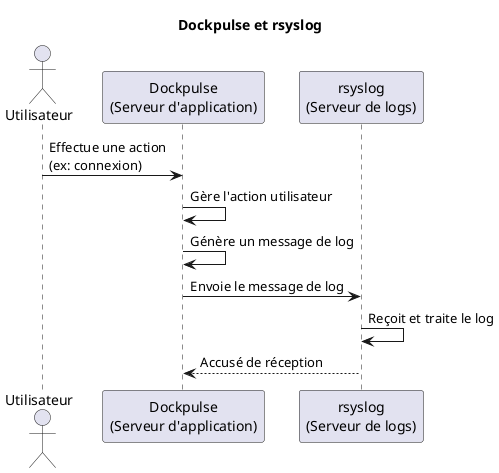

```plantuml
@startuml
title Dockpulse et rsyslog

actor Utilisateur
participant "Dockpulse\n(Serveur d'application)" as Dockpulse
participant "rsyslog\n(Serveur de logs)" as Rsyslog

Utilisateur -> Dockpulse : Effectue une action\n(ex: connexion)
Dockpulse -> Dockpulse : Gère l'action utilisateur
Dockpulse -> Dockpulse : Génère un message de log
Dockpulse -> Rsyslog : Envoie le message de log
Rsyslog -> Rsyslog : Reçoit et traite le log
Rsyslog --> Dockpulse : Accusé de réception

@enduml
```
